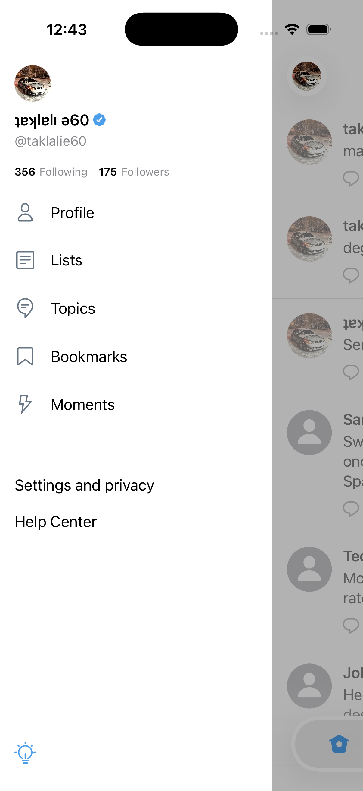
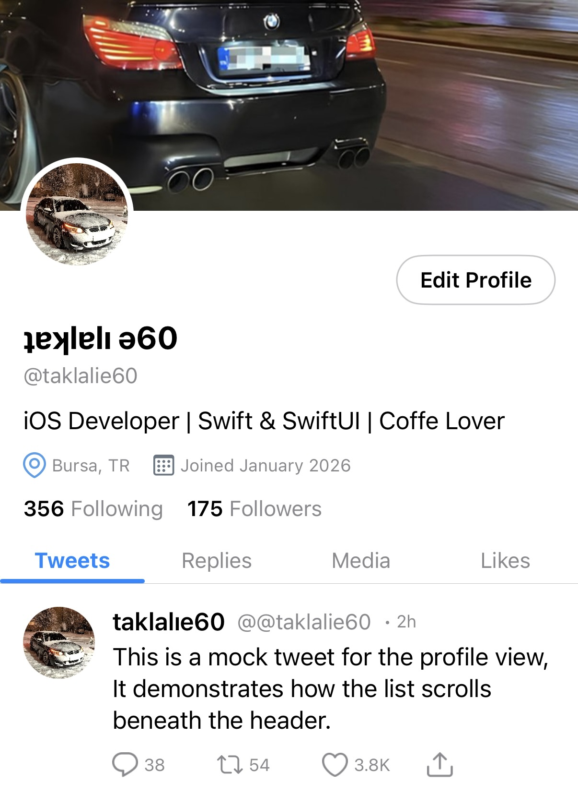
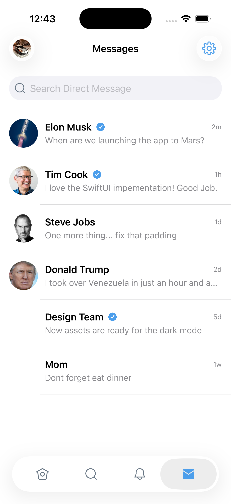
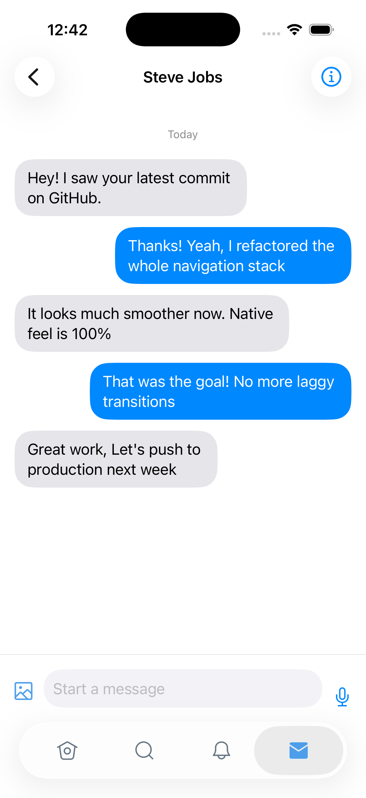
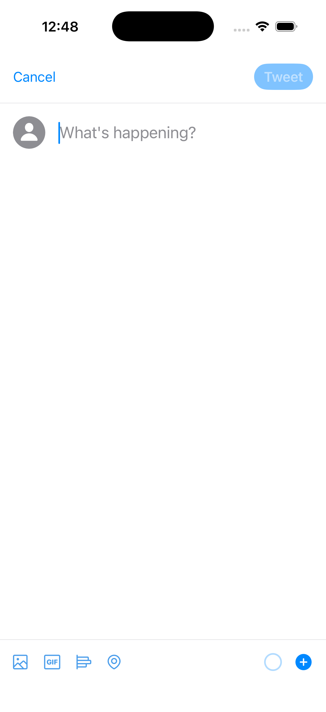

# 🐦 X (Twitter) Clone - SwiftUI

[](https://developer.apple.com/swift/)
[](https://developer.apple.com/ios/)
[](LICENSE)

A high-fidelity clone of the **X (formerly Twitter)** iOS application, built entirely with **SwiftUI**. This project demonstrates modern iOS development practices, including **MVVM architecture**, **Async/Await networking**, complex UI animations, and local data persistence.

The app features a hybrid data approach: it connects to the real Twitter API for some features while using realistic mock data for premium-tier restricted features (like DM & Notifications).

---

## 📸 Screenshots

| Home Timeline | Side Menu | Profile View |
|:---:|:---:|:---:|
|  |  |  |

| Direct Messages | Chat Interface | New Tweet |
|:---:|:---:|:---:|
|  |  |  |

---

## 🚀 Key Features

### 📱 User Interface (UI) & UX
* **Custom Side Menu (Drawer):** Fully animated side menu with gesture support. Swipe from the left edge or tap the overlay to close, just like the native app.
* **Parallax Profile Header:** Dynamic sticky header animation on the profile page using `GeometryReader`.
* **Sliding Filter Bar:** Smooth `MatchedGeometryEffect` animations for switching between Tweets, Replies, and Media tabs.
* **Dark/Light Mode:** Full support for system-wide appearance settings.

### 🏗 Architecture & Logic
* **MVVM Pattern:** Clean separation of concerns with distinct Views, ViewModels, and Models.
* **Networking:** Hybrid `APIManager` that supports both real API calls and fallback Mock Data generation.
* **Async/Await:** Modern concurrency handling for fetching tweets.
* **Local Persistence:** User-generated tweets are saved locally using `UserDefaults` and merged with API data upon app launch.
* **Chat System:** A realistic messaging interface with different bubble styles for the sender/receiver and auto-scrolling logic.

---

## 🛠 Tech Stack

* **Language:** Swift 5
* **Framework:** SwiftUI
* **Networking:** URLSession (Native)
* **Authentication:** OAuth 1.0a (Custom Implementation)
* **Storage:** UserDefaults (Local Persistence)
* **Version Control:** Git & GitHub

---

## 📂 Project Structure

```text
Twitter/
├── Managers/
│   ├── APIManager.swift       # Network Logic (Real + Mock)
│   └── OAuth.swift            # Authentication Helper
├── Models/
│   ├── Tweet.swift            # Data Model
│   └── Message.swift          # Chat Data Model
├── ViewModels/
│   └── TimelineViewModel.swift# Logic for Home Feed
├── Views/
│   ├── MainTabView.swift      # Tab Bar Navigation
│   ├── HomeTimelineView.swift # Main Feed
│   ├── SideMenuView.swift     # Custom Drawer
│   ├── ProfileView.swift      # Parallax Profile
│   ├── NewTweetView.swift     # Compose Sheet
│   ├── ChatView.swift         # Messaging UI
│   └── ... (Other Views)
├── ContentView.swift      # Root View
├── TwitterApp.swift       # Entry Point
└── Assets.xcassets            # Icons & Images
